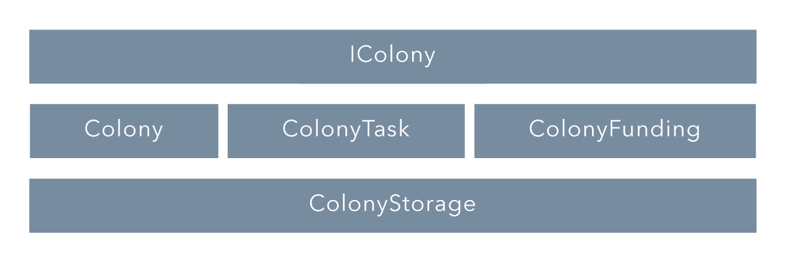

The Colony Network, at a high level, is a collection of smart contracts on the Ethereum blockchain.

The contracts that comprise the Colony Network provide a standard framework for the creation of decentralized organizations as described in the [Colony Whitepaper](https://colony.io/whitepaper.pdf).

In addition to the core business logic of all colonies, the Colony Network contains several contracts that mediate low-level transactions and permissions on the blockchain, such as [upgradability](/colonynetwork/docs-upgrades-to-the-colony-network/), as well as contracts which manage functionality of the network as a whole, including interactions with the reputation system and the creation of new colonies.

The Colony Network is maintained and improved by [The Meta Colony](/colonynetwork/docs-the-meta-colony-and-clny/).

Developers interested in contributing to the Colony Network are encouraged to look at the code on [GitHub](https://github.com/JoinColony/colonyNetwork), and to come say hi on [Gitter](https://gitter.im/JoinColony/colonyNetwork). Please have a look at our [contribution guidelines](https://github.com/JoinColony/colonyNetwork/blob/develop/docs/CONTRIBUTING.md) as well.

## Interface Contracts
The full collection of Colony Network contracts can be inspected on [GitHub](https://github.com/JoinColony/colonyNetwork). Once deployed, however, the publically available functions for interacting with the Colony Network are aggregated into two Interface contracts:

* `IColony.sol` contains the functions that pertain to a particular colony, including the creation of tasks, funding, and work ratings.

* `IColonyNetwork.sol` contains the functions that pertain to the network as a whole, such as the global hierarchy of skill tags and interactions with the reputation mining client.

* `IReputationMiningCycle.sol` contains the functions that pertain to the reputation mining system, such as submission of a reputation root hash, staking, and initiating the challenge process.

## Layered Model of the Colony Network
The Colony Network's [upgrade pattern](https://docs.colony.io/colonynetwork/docs-upgrades-to-the-colony-network/) allows for an interface with a static address on chain to be the single point of entry. All functions called by a user on the interface are redirected via a middle routing layer to the contract logic holding the function implementation.

Business logic, such as the creation and funding of a task, is split into separate contracts within the middle layer based on context. The logic contracts inherit from a separate set of storage contracts, in which all storage variables are written.

## First Version
The first deployed version of the Colony Network will have a more modest functionality than what is described in these pages and in the whitepaper. This is intended to allow further development for finished contracts to be informed by real user experiences and testing while new features are being developed for future iterations of the network.

The major differences between the planned first release and the system described in the whitepaper are:

* Domains within a colony will be restricted to a single level.
* Voting, Objections, and Dispute resolution will not be included.
* Reputation will not mediate colony member's ability to interact with certain functions. Instead, the [authority roles](/colonyjs/api-authorityclient/) will be used to grant the OWNER and ADMIN roles the ability to call certain priviledged functions such as creating a new task.

Subsequent versions of the Colony Network will add functionality (working toward a complete implementation of the whitepaper), and all deprecated versions will remain fully supported by the network after an upgrade. See [upgrades](/colonynetwork/docs-upgrades-to-the-colony-network/) for more information.
