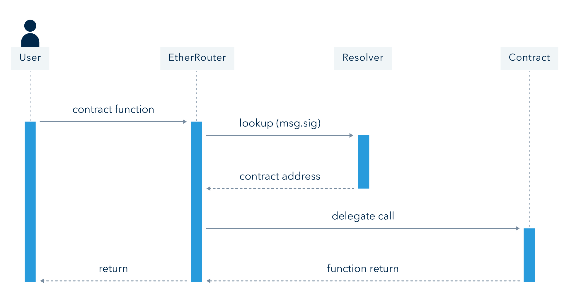

## For whom the delegate calls
Interacting with both the Colony Network and individual colonies on the network is somewhat different than many other smart contract interactions that a relatively new blockchain developer might not be accustomed to.

Rather than calling functions directly from the contract in which they are deployed, all transactions are signed and sent to the `EtherRouter` contract.

Whenever a transaction is received by the `EtherRouter` contract, it looks the function up in a `Resolver` contract, using the function signature.

The `Resolver` contract contains a mapping of whitelisted function signatures to addresses (`mapping ( bytes4 => address )`).

A function signature lookup will return the address of the contracts which implement the desired function back to `EtherRouter`, which in turn calls the function via `delegatecall`, and passes any returns back to `msg.sender`.

This pattern enables both fine-grained control of permissions for individual functions (see below), well as eternal backwards-compatibility following network upgrades. To learn more about planned upgrades to the Colony Network, please see [Releases]()

## It calls for `roleId`
Most functions in colony are *authorized* by a separate contract which defines the rules for who can call which functions. Any function that is decorated with the `auth` modifier will perform an authorization check before granting access to the function.

In the current Glider release, authority is based on roles, which are defined in the relevant "authority" contracts, e.g. `ColonyAuthority.sol`.

Roles within Colony act as a white-list for functions, registering specific addresses to a `Founder` or `Admin` role, approved to call a certain set of functions within a colony.

Roles also are used in task-level permissions. A more specific example of task roles can be seen in the [task workflow](https://docs.colony.io/colonyjs/topics-task-lifecycle/#task-roles).

In future releases, this pattern will allow for reputation-mediated authority in Colony.
Improvements to the Colony Network are expected to be continuously developed and periodically deployed.

Providing an upgrade path is important to allow people to use Colony without preventing themselves using new features as they are added to the Network. At the same time, all depreciated versions of Colony should remain functional indefinitely after deployment, so that the organizations created are not predicated upon the actions/efforts of a third party.

The contracts comprising the Colony Network are upgradeable using the design pattern called EtherRouter.
